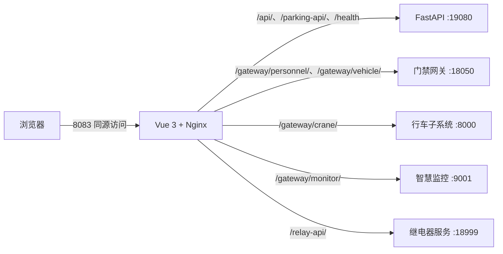

# 南钢智慧大屏前端

南钢智慧大屏前端基于 Vue 3、TypeScript、Vite 和 Nginx 构建。生产环境采用
Docker 部署，浏览器通过同源路径访问 FastAPI 和各业务子系统，内网与
WireGuard 使用同一套页面和接口配置。

当前版本：`v3.0.0`

## v3.0.0 与 v2.0.0 的区别

| 项目       | v2.0.0                         | v3.0.0                                             |
| ---------- | ------------------------------ | -------------------------------------------------- |
| 系统架构   | 单一前端容器，业务接口配置较少 | 前后端分离，前端通过 Nginx 同源代理 FastAPI        |
| 车辆管控   | 以设备映射和基础展示为主       | 新增停车管理页面、10路道闸状态、车辆记录和实时统计 |
| 车辆预约   | 无停车软件白名单闭环           | 预约车牌下发停车软件，有效期内识别后自动放行       |
| 车辆档案   | 无同步状态                     | 显示已同步、待同步、失败、未下发，并支持重试       |
| 设备范围   | 早期设备映射                   | 接入7至11号门共10个进出通道，12号门不接入          |
| 大屏数据   | 部分概况数据为静态或独立来源   | 车辆在场、智慧监控、行车概况与子系统数据联动       |
| 天气与健康 | 固定天气和旧服务状态           | 南京实时天气、FastAPI健康检查和SSE实时更新         |
| 网络访问   | 内网与WG存在地址差异           | 使用同源网关，内网与WG保持一致                     |
| 消息链路   | 历史版本包含MQTT相关链路       | 前端不依赖MQTT，统一使用REST和SSE                  |

详细发布说明见 [v3.0.0 发布说明](docs/releases/v3.0.0.md)。

## 系统结构



本仓库只包含前端和 Nginx 配置。FastAPI、PostgreSQL、Redis、停车软件适配器
和设备采集 Worker 位于独立后端仓库，部署前需要先保证后端服务可用。

## 功能入口

- `/cockpit`：智慧大屏主界面。
- `/parking`：车辆管控与停车管理。
- `/gateway/personnel/`：人员管控子系统。
- `/gateway/vehicle/`：车辆管控子系统兼容入口。
- `/gateway/crane/`：行车子系统。
- `/gateway/monitor/`：智慧监控子系统。
- `/health`：后端健康状态。

## 安装要求

生产服务器需要准备：

- Linux x86_64 服务器。
- Docker Engine 24 或更高版本。
- Docker Compose v2，命令为 `docker compose`。
- 能访问 npm 镜像源或 npm 官方仓库。
- 能从 Docker 容器访问 FastAPI 和各业务子系统地址。
- 宿主机开放前端端口，默认 `8083`。

确认安装环境：

```bash
docker --version
docker compose version
git --version
```

## Docker 安装

### 1. 获取 v3.0.0

```bash
git clone https://github.com/yyh111222333/NgDataTwinFrontedDemo.git
cd NgDataTwinFrontedDemo
git checkout v3.0.0
```

### 2. 创建环境配置

```bash
cp .env.example .env
```

编辑 `.env`。下面是南钢当前部署结构的示例，地址需要按目标服务器实际网络修改：

```dotenv
FRONTEND_PORT=8083
NPM_REGISTRY=https://registry.npmmirror.com

# 留空表示浏览器通过Nginx同源访问
VITE_API_BASE_URL=

# Docker容器必须能够访问这些地址
PLATFORM_API_UPSTREAM=http://192.168.10.11:19080
ACCESS_GATEWAY_UPSTREAM=http://192.168.10.11:18050
CRANE_UPSTREAM=http://192.168.10.11:8000
MONITOR_UPSTREAM=http://192.168.10.11:9001
RELAY_UPSTREAM=http://192.168.10.11:18999
SMART_MONITOR_UPSTREAM=http://192.168.10.11:18051

# 本地开发代理目标，生产Docker不使用此项
VITE_DEV_GATEWAY_TARGET=http://10.13.0.8:8083
```

配置项说明：

| 配置项                    | 默认值        | 用途                                       |
| ------------------------- | ------------- | ------------------------------------------ |
| `FRONTEND_PORT`           | `8083`        | 前端宿主机端口                             |
| `NPM_REGISTRY`            | 国内 npm 镜像 | Docker 构建依赖源                          |
| `VITE_API_BASE_URL`       | 空            | 空值表示使用同源接口，生产环境推荐保持为空 |
| `PLATFORM_API_UPSTREAM`   | `:19080`      | FastAPI、停车、天气、SSE和健康检查         |
| `ACCESS_GATEWAY_UPSTREAM` | `:18050`      | 人员及车辆兼容网关                         |
| `CRANE_UPSTREAM`          | `:8000`       | 行车子系统                                 |
| `MONITOR_UPSTREAM`        | `:9001`       | 智慧监控页面                               |
| `RELAY_UPSTREAM`          | `:18999`      | 道闸和继电器服务                           |
| `SMART_MONITOR_UPSTREAM`  | `:18051`      | 智慧监控概况数据                           |
| `VITE_DEV_GATEWAY_TARGET` | WG大屏地址    | 本地 Vite 开发代理目标                     |

不要将账号、密码、停车软件密钥或生产 `.env` 提交到 GitHub。

### 3. 检查并启动

```bash
docker compose config
docker compose up -d --build frontend
```

查看容器状态和日志：

```bash
docker compose ps
docker compose logs --tail=100 frontend
```

`docker-compose.yml` 只管理 `ngdtdemo-frontend`，不会创建、停止或重建宿主机
`5000` 端口上的其他容器。

### 4. 验证部署

```bash
curl -fsS http://127.0.0.1:8083/health
curl -I http://127.0.0.1:8083/cockpit
curl -I http://127.0.0.1:8083/parking
```

健康接口应返回 FastAPI、PostgreSQL、Redis 和采集 Worker 状态。浏览器访问：

- 内网：`http://<服务器内网IP>:8083/`
- WireGuard：`http://<服务器WG地址>:8083/`
- 车辆管控：`http://<服务器地址>:8083/parking`

浏览器始终请求当前访问地址下的 `/api/` 和 `/parking-api/`，因此不需要为内网与
WireGuard 分别构建前端。

## 从 v2.0.0 升级到 v3.0.0

升级前先确认 FastAPI 后端已经部署并能从前端容器访问。然后只重建前端服务：

```bash
cd NgDataTwinFrontedDemo
git fetch --tags origin
git checkout v3.0.0
cp .env.example .env
# 修改.env中的各上游地址
docker compose config
docker compose up -d --build --force-recreate frontend
```

升级后检查：

```bash
curl -fsS http://127.0.0.1:8083/health
docker compose logs --tail=100 frontend
```

升级命令只作用于当前 Compose 项目的前端服务，不要执行全局 Docker 清理命令。

## 回滚到 v2.0.0

```bash
git checkout v2.0.0
docker compose up -d --build --force-recreate frontend
```

`v2.0.0` 不包含 v3.0.0 的同源 FastAPI 网关、停车管理和白名单同步界面。回滚前应
确认旧版所需接口仍然可用。

## 本地开发

本地开发需要 Node.js `20.19+` 或 `22.12+`：

```bash
npm ci
cp .env.example .env
npm run dev -- --host 0.0.0.0
```

常用检查命令：

```bash
npm run type-check
npm run build
npm run lint
```

本地 Vite 会将同源接口代理到 `VITE_DEV_GATEWAY_TARGET`。开发机必须能够访问该
目标地址。

## 常见问题

### 右上角显示服务器离线

```bash
curl -v http://127.0.0.1:8083/health
docker compose logs --tail=100 frontend
```

检查 `PLATFORM_API_UPSTREAM` 是否能从前端容器访问：

```bash
docker exec ngdtdemo-frontend wget -qO- http://192.168.10.11:19080/health/ready
```

### 页面能打开但子系统没有数据

核对 `.env` 中对应上游地址，并在修改后重新创建前端容器：

```bash
docker compose up -d --build --force-recreate frontend
```

### 内网正常但WG不正常

不要在前端构建参数中写死内网 IP。保持 `VITE_API_BASE_URL=` 为空，通过 Nginx
同源代理访问后端；同时确认 WG 客户端能访问服务器 `8083` 端口。

## 目录说明

```text
src/                 Vue 3 前端源码
src/views/parking/   停车管理页面
src/components/      大屏及业务组件
src/api/             REST和SSE接口封装
nginx/               生产同源网关配置
docs/                接口、设备和发布文档
Dockerfile           前端生产镜像
docker-compose.yml   前端容器编排
```

闸机 SVG 元素命名约定见 [闸机 SVG 命名规则](docs/gate-svg-naming.md)。

## 设备范围

车辆管控当前接入7至11号门，共10个进出通道。12号门不在本版本接入范围内。
车辆预约和车辆档案由 FastAPI 下发到停车软件白名单，实际抬杆由停车软件在识别到
有效车牌后按现场车道规则执行。
