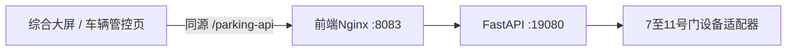

# 车辆管控子系统前端接入

本仓库只保存Vue前端与Nginx网关。FastAPI、PostgreSQL、Redis和设备采集代码位于
私有仓库 `Wangpengyu01/nangang-platform-backend`。

## 数据链路



## 访问入口

- 综合大屏：`http://<服务器>:8083/cockpit`
- 车辆管控：`http://<服务器>:8083/parking`
- 前端健康代理：`http://<服务器>:8083/health`
- 后端直连：`http://<服务器>:19080/health/ready`

前端通过 `/parking-api/` 读取车辆统计、进出记录、场内车辆和通道状态。现场要求API免登录，
车辆档案页面可直接维护；远程开闸仍会弹出确认框，并向后端提交
`MANUAL_GATE_CONTROL` 二次确认值。

南京天气通过 `/api/public/weather` 获取，实时更新连接为
`/api/public/realtime/stream`。天气查询失败时前端保留最近一次成功结果。

## 部署

```bash
docker compose build frontend
docker compose up -d frontend
```

Nginx上游使用环境变量配置，默认指向 `192.168.10.11`。浏览器始终访问同源路径，
因此LAN和WireGuard入口具有相同效果。
