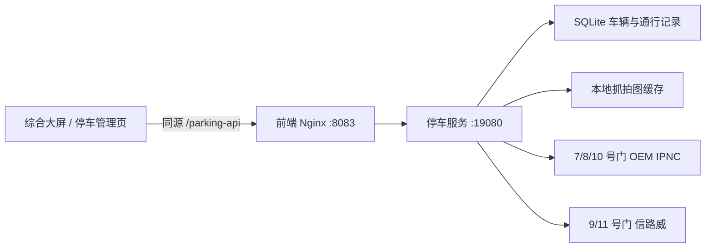

# 车辆管控子系统

## 架构

停车服务直接轮询 10 台车牌识别相机，不依赖旧 Windows 停车平台。OEM IPNC 设备通过 `/request.php` 读取记录；信路威设备通过 `Signalway.fcgi` 读取记录和抓拍图。服务按设备、时间和记录编号去重，并按车牌自动配对进出场记录。

## 访问入口

- 综合大屏：`http://<服务器>:8083/cockpit`
- 车辆管控：`http://<服务器>:8083/parking`
- 服务健康：`http://<服务器>:8083/parking-health`
- 后端直连：`http://<服务器>:19080/health`

普通访问可直接查看统计、车辆记录和设备状态。车辆档案维护、手动同步及远程开闸需要管理员登录。只有信路威相机开放了已验证的远程开闸命令；其余设备不会显示开闸按钮。

## 部署

1. 参考 `.env.parking.example` 在服务器创建私有 `.env`，不要提交真实密码。
2. 执行 `docker compose build parking frontend`。
3. 执行 `docker compose up -d parking frontend`。
4. 检查 `/parking-health` 返回的在线通道数量和停车页中的最新记录。

SQLite 数据库和抓拍图保存在 Docker 卷 `parking-data` 中，更新容器不会清空历史数据。
